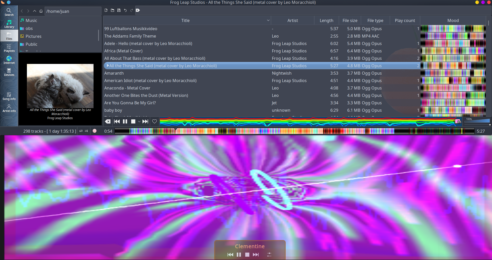

# OBS-Starter-Kit

- [OBS Studio](https://obsproject.com/download) Starter Kit.

# Getting started

## Clementine

Clementine Music Player

Clementine is an open source Qt5 Music player with very modern and visually attractive UI,
that makes it ideal for playing music while occasionally showing the player on stream and dont get everyone bored quickly,
it uses few resources and disk space because its C, uses less resources than Spotify, and uses no Network by default.

# Uninstall

- Delete it.

# Requisites

- [OBS Studio](https://obsproject.com/download) for Linux or Mac.

## Stars

# Contributing

- No Unittests required.
- At least Tweet-sized documentation must be provided, so people can understand what it is.
- No Ads, Watermarks, or similar on the contributed resources, to keep it clean for everyone.
- You can link to your pages and add explicit credit on documentation of such resources.
- Basically the resources contributed here must be clean, if you want to link your page and charge for premium resources there, is Ok, but resources on this repo must be clean.

# FAQ

- This runs on Windows ?.

Yes. But most people use the Proprietary OBS from Twitch on Windows, so is untested.

- This runs on Mac ?.

Yes.

- This runs on ARM and Raspberry Pi and Notebooks ?.

Yes.

[  ⬆️  ⬆️  ⬆️  ⬆️  ](#OBS-Starter-Kit "Go to top")
