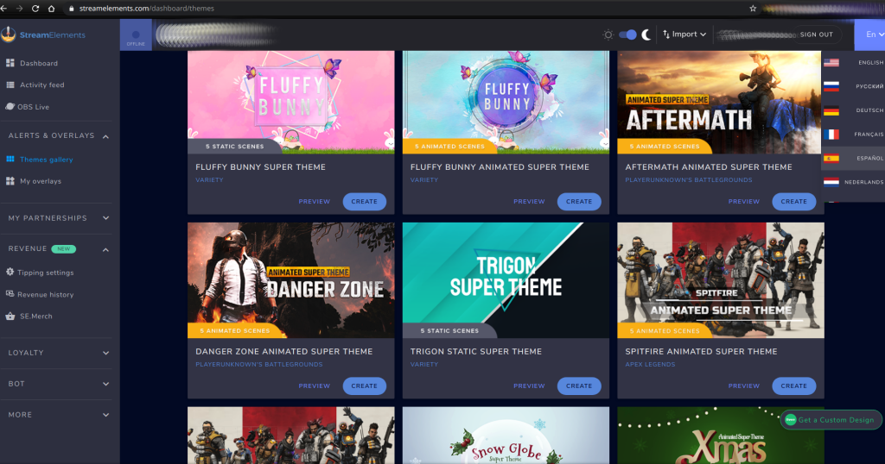
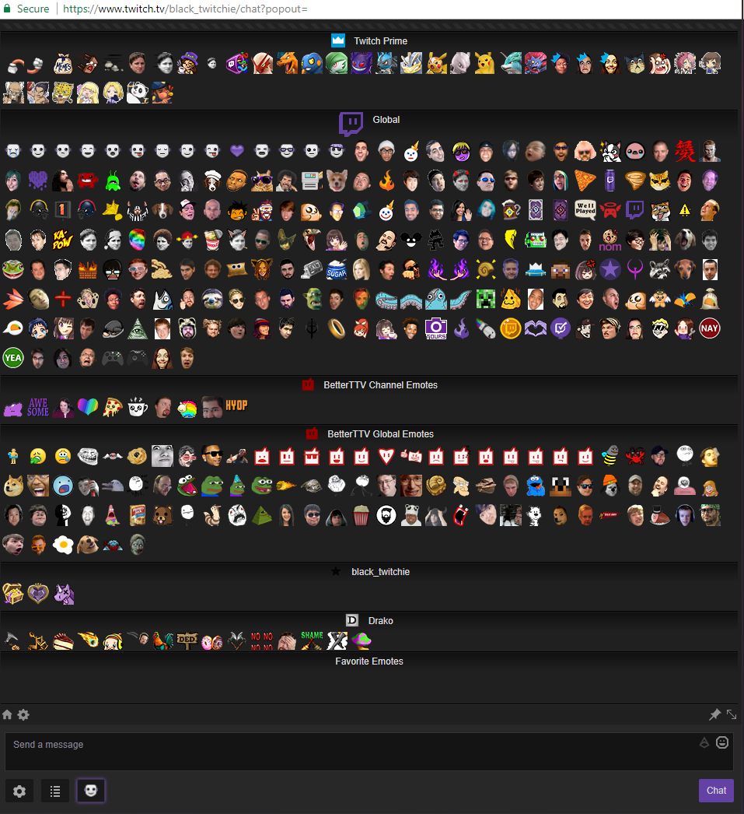
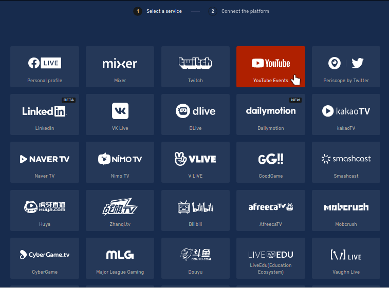
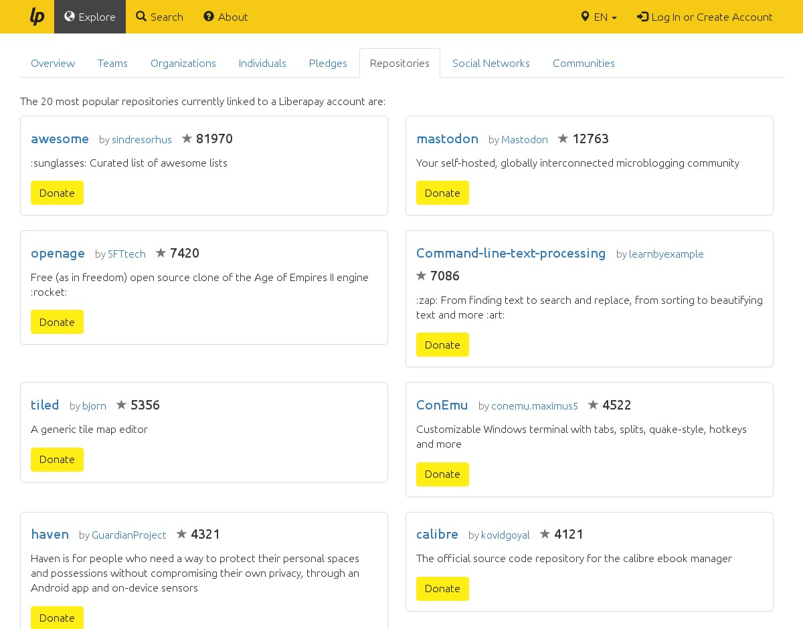

# Awesome Streaming Tools


Visually attractive eye candy and useful tools that you can show off on your stream, install the ones you see fit...


# Table Of Contents

| | | | |
|:--------:|:--------:|:--------:|:--------:|
| [OBS Plugins](#obs-plugins) | [Overlays](#overlays) | [Desktop Apps](#desktop-apps) | [Web Based Tools](#web-based-tools) |
| [Mobile Apps](#mobile-apps) | [Twitch Extensions](#twitch-extensions) | [Stream Animator](#stream-animator) | [Livestreaming Glossary](#livestreaming-slang-twitch-glossary)         |


# OBS Plugins

- `obs-multi-rtmp` https://github.com/sorayuki/obs-multi-rtmp (Alternative is to use [
](#ReStream) )
- `obs-linuxbrowser` https://github.com/bazukas/obs-linuxbrowser
- `obs-input-overlay` https://github.com/univrsal/input-overlay
- `obs-plugin-spectralizer` https://github.com/univrsal/spectralizer
- `closed-captioning-obs-plugin` https://github.com/ratwithacompiler/OBS-captions-plugin#closed-captioning-obs-plugin
- OBS Move Transitions https://github.com/exeldro/obs-move-transition
- OBS Background removal https://github.com/royshil/obs-backgroundremoval#introduction

**Plugin Install:**

- Linux: Plugins should be installed to `~/.config/obs-studio/plugins/`
- Windows: `C:\Program Files\OBS-Studio\obs-plugins\64bit\`
- Plugins are `*.so` files on Linux and Mac, and `*.dll` on Windows.


# Overlays



[Streamelements](https://streamelements.com) is a Free service that provides Overlays,
Alerts, Monetization, Merchandasing Store, Chat Bots, Spam Filters, Stats, Chat Commands,
Media Requests (viewers can musicalize the stream via Youtube links), Stats and more for streamers.

All the Overlays are provided via 1 URL link that you use on your OBS Studio "Browser Source" (`obs-linuxbrowser`).
Overlays has an online web visual editor with a lot of free themes to use and remix.

Overlays and Alerts are important because is the only *visual* way to know when someone is giving you money,
like Donations, Bits, Cheers, etc and also important events like Raids with lots of new viewers.

# Fiver Twitch Store

Anything you need for a few dollars

- https://www.fiverr.com/stores/twitch
- https://www.fiverr.com/categories/programming-tech/development-for-streamers


# Desktop Apps

## BetterTTV



[BetterTTV](https://betterttv.com/emotes/top) is an [open source web browser extension](https://github.com/night/BetterTTV)
that adds extra features to Twitch stream chats like animated emotes and more, is very popular on streams,
if you dont understand why a lot of people on your chat types `monkaS` is probably that you need this browser extension,
you can also add you own customized animated emotes for your chat, also supports not-animated emotes, its free $0 cost.


## Orion

[Orion](https://alamminsalo.github.io/orion) is an open source crossplatform Qt5/QML Twitch Desktop Client app, with all basic features working,
emojis and unicode works, copy&paste works, is very lightweight being coded on C++, it wont replace the web but if you only need to watch streams is very comfy.

[](https://alamminsalo.github.io/orion)


## Webcamoid

[Webcamoid](https://webcamoid.github.io) is an open source Qt5 WebCam app with advanced settings and real time filters and effects,
is very lightweight being coded on C, uses few resources, it can add custom effects to your webcam on real time,
it can cover faces with PNG images, it can blurry faces, it can add face masks, cover you with fire or glow halo and more fancy toys.

[](https://webcamoid.github.io "Real time effects for your camera")


## Visual Studio Code

[Visual Studio Code](https://code.visualstudio.com) is an open source ElectronJS code editor that [has stream oriented plugins](https://dev.to/ninjabunny9000/5-useful-vscode-extensions-for-live-coding-239b),
that allows your viewers to interact with the editor and the code in it using chat commands and more.
It is the only editor that we can find that has stream oriented plugins.


## RIPcord


[RIPCord](https://cancel.fm/ripcord) is an alternative Discord Chat Client.
RIPcord is a lot faster and more ligh weight compared to the official one,
it is written in C and Qt 5, has Dark theme and also supports Slack chats.


## Clementine

[Clementine Music Player](https://www.clementine-player.org) is an open source crossplatform Qt5 Music player with very modern and visually attractive UI,
that makes it ideal for playing music while occasionally showing the player on stream and dont get everyone bored quickly,
it uses few resources and disk space because its C, uses less resources than Spotify, and uses no Network by default.

It has a playlist with "Mood bars" that represents the mood of the song using colors (sad music, happy music, slow paced music, etc).
The playlist also has a column "Play Count" so you can see how many times that song has been played on stream.
The Playlist has a Rating colum with 5 Stars widgets, so you can rate the songs too.
It can show random baby Kitten photos for missing music cover photos.
If you dont have Designs for *"Will be back soon"* kind of screens, just leaving the player on shuffle will do, at least for a while.

[](https://www.clementine-player.org)


## Flameshot

[Flameshot](https://github.com/lupoDharkael/flameshot) is an open source crossplatform Qt5 Screenshot app with tools and nice UI, it has a TryIcon and a window widget,
very nice if you need to take screenshots for your stream.

[](https://github.com/lupoDharkael/flameshot#--------------------------------flameshot---- "Cool screenshots")


## Cool Retro Term

[Cool Retro Term](https://github.com/Swordfish90/cool-retro-term#cool-retro-term) is a is an open source crossplatform Qt5/QML Terminal app,
with configurable effects, you can disable any or all effects too, copy&paste works, for the rest is a normal terminal app but looks fancy.

[ ](https://github.com/Swordfish90/cool-retro-term#cool-retro-term)


## SWCursor

[SWCursor](https://github.com/andykitchen/swcursor#swcursor) is a simple C program that allows you to use any PNG image as Mouse cursor,
so you can use your Logo as cursor or an extra big cursor on your stream. You can remove the cursor by closing the program.

[](https://github.com/andykitchen/swcursor#swcursor)


## Oneko

Kitten that chases the mouse pointer desktop toy, very very lightweight and simple.
http://www.daidouji.com/oneko
https://aur.archlinux.org/packages/oneko


## Blender

[Mixer](https://github.com/ubisoft/mixer#mixer) is a Blender addon developed at Ubisoft Animation Studio for Real Time Collaboration in 3D edition.
It allows multiple Blender users to work on the same scene at the same time.
If you livestream digital Art, you can colab with other streamers or viewers.


# Mobile Apps

## Twire

[Twire](https://f-droid.org/en/packages/com.perflyst.twire) is an open source Android Twitch Client app for Mobile,
is a lot more lightweigth than the official app and the features are almost the same, copy&paste works, emoji and unicode works too.


# Web Based Tools

## ReStream

[ReStream](https://restream.io) re-streams your stream into several platforms for free,
you need to register and it will provide you with an URL and secret token to use on OBS.



## Pogged TV

Uses AI to analize video and chat in real time and generate a 24/7 continous stream of "Pog Moments" on Twitch https://pogged.tv
https://pogged.tv/
## TwitchRoulette

[TwitchRoulette](https://twitchroulette.net) Spin the wheel and match with a random streamer with no viewers.
Say hi! Make new Friends!.


## MultiTwitch

You can use [MultiTwitch](http://www.multitwitch.tv) to watch any number of [Twitch](https://www.twitch.tv) streams at the same time (as long as your computer can handle it).
Simply put the streams you want in the url.
[MultiTwitch](http://www.multitwitch.tv) will optimize the layout of streams to give you the maximum size on each of the streams,
while maintaining aspect ratio.
Source https://github.com/bhamrick/multitwitch


## Featured Chats

https://featured.chat is a free web tool for Streamers created by [Djwheat](https://twitch.tv/djwheat),
it is a tool to showcase and groom all the chat activity on a channel and feature individual chat messages on screen in the broadcast.

It is not an extension: The tool is made up of 2 web pages.
One for Management, a webpage in your browser to curate/moderate the messages,
one for your broadcast software, a browser source you can plug into OBS.

Documentation Manual: https://featured.chat/manual


## Gather Town

https://gather.town free tier up to 25 people, free for guests, everyone can build stuff like a game, chat, video and audio streaming calls, can login with Google,
password protection option, Admins can configure the virtual spaces, 2D game look and feel makes it lightweight and fun, lots of maps.


## Bonk

https://bonk.io is a web browser game.

## Jackbox

https://jackbox.tv is a web browser game designed for Twitch.

## Voice Avatar

Waifu Avatar Voice Synth, free online anonymous no-registration https://nanakoe-nina.dena.ai
After making a new recording click on "Good" button and it will give you a download button.


## LiberaPay



[LiberaPay](https://liberapay.com) is an open source free web service that allows you to take Donations $,
it is like an alternative to Patreon and similar services,
when you stream on a fixed constant schedule eventually people will start asking for a way to Donate to you,
this is the only service we can find that do not take a big chunk of your donation,
with this service 100% of the money goes to you, as far as we know it works internationally.

## OpenSelery

[OpenSelery](https://github.com/protontypes/openselery#continuous-and-transparent-developer-payout) is a decentralized framework for a free and transparent salary distribution in free software.
It defines a funding distribution to generate a transparent and adaptable cash flow to your digital project and all its contributors.
Transparent payout to the developers of your Github project.
Distribution of money is done via Bitcoin (currently via Coinbase).
Transparent payout with public Logs. This tools remains to be investigated, but is still in development too.

## ShowMeTheWay

[ShowMeTheWay](https://osmlab.github.io/show-me-the-way) is an open source web service that shows real time updates on [OpenStreetMap](https://www.openstreetmap.org),
If you dont have Designs for *"Will be back soon"* kind of screens, just leaving this web on screen will do, at least for a while.

## LiveOpenStreetMap

[LiveOpenStreetMap](http://live.openstreetmap.fr) is an open source web service that shows real time updates on [OpenStreetMap](https://www.openstreetmap.org),
If you dont have Designs for *"Will be back soon"* kind of screens, just leaving this web on screen will do, at least for a while.

## Jamendo

[Jamendo](http://jamendo.com) is a web service where you can find free music without copyright nor royalty costs,
you can download full quality music for free to use on your streams and dont get muted, etc.


## PeerFast

[PeerFast](https://diegorbaquero.github.io/PeerFast) is a Free Open-Source Internet speed check,
it runs completely on your PC, it is anonymous, no login nor account required, runs from your browser.

## WindowSwap

- https://window-swap.com

## VoiceNotebook

[VoiceNotebook](https://voicenotebook.com) can save transcriptions of your streams in real time automatically for free,
keep transcription logs of past streams!.

Speech to text online, Mac, Windows and Linux integration.
Direct speech input in Windows, Mac and Linux. Voice typing to clipboard.
Free Audio to text transcription (mp3, mp4, Youtube). Android and iOS Apps.


## Tetris Online Multiplayer

- [Tetrio](https://tetr.io) is a free open source online multiplayer with custom rooms that you can use to play with viewers.
  Desktop App for Linux, Windows, Mac.


## Skribbl

- [Skribbl.io](https://skribbl.io) is a free online multiplayer drawing and guessing game that can be used to play with viewers. Rooms can either be randomized or private. Custom drawing prompts can be created in private rooms.


## GeoGuessr

- [GeoGuessr](https://www.geoguessr.com) is an online multiplayer Geography Trivia game that you can use to play with viewers.
  Places to guess are randomized. You must pay to use it, free tier is 1 game per day. Has a dedicated category on Twitch.

See also:
- https://geotips.net
- https://chatguessr.com


## City Guesser

[City Guesser](https://virtualvacation.us/multiplayer) is similar to GeoGuessr but free and uses video with audio instead.
Free multiplayer private rooms with admin customized settings, Streamer mode, no registration required,
people can join by PIN or link, singlePlayer mode, rankings and leaderboard at the end of the game, all game flow has auto timeout,
Kilometer or Miles option, 2x video speed, option to jump back 10 seconds on the video. [Has a dedicated category on Twitch.](https://www.twitch.tv/directory/game/City%20Guesser)

## Keyma

[Keyma.sh](https://keyma.sh) online multiplayer Typing race game where you can go head to head versus players around the world.
[Has a dedicated category on Twitch.](https://www.twitch.tv/directory/game/Keyma.sh)

## JSTris

https://www.twitch.tv/directory/game/Jstris
https://jstris.jezevec10.com

## Mozilla Hubs

https://hubs.mozilla.com


## DuoLingo

- [DuoLingo](https://www.duolingo.com) is a free game app to learn spoken languages that you can use to play with viewers.
  Has a dedicated category on Twitch.

## HigherLower

- http://www.higherlowergame.com


## E-Girls

Do you want to stream a multi-player game and no one of your friends like to play the game?,
you can rent [E-Girls](http://egirl.gg) to play game sessions with you (or [E-Boys](http://egirl.gg)).
The service is NOT Free, you must pay, prices may vary.

## Live Curtain

[Live Curtain](https://livecurtain.com) is a web page that displays a message of your choice, and an optional countdown clock. It's easy to use, whenever you want to show a message to your audience, such as: a 'stream starting soon' screen, or to say you're on a break. Enter your text, choose a theme, and share your browser window in your streaming tool.

# Twitch Extensions

Few Twitch extensions for tech streams, random order, as example, theres always more on the Twitch catalog.

Something to consider for tech streams is that sometimes the most popular and effective Twitch Extensions for other categories can fail on tech streams,
that tend to have less than 100 viewers, because if the extension is too Bits hungry no one will really use it,
so Twitch Extensions without Bits, at least for basic functionality are preferred.

The Gaming stream extensions are over-saturated, the Tech stream extensions are underrated.

## Exclusive Content for Subscribers

https://dashboard.twitch.tv/extensions/7kodks69rwf64tad7558abd0268uzl-0.0.4

## Streamer Timezone

https://dashboard.twitch.tv/extensions/zowhdiwf4lqqoa99rphz5y38235qxu-0.0.1

## Overlays as Extensions

https://dashboard.twitch.tv/extensions/tdldrg6rlw5eewiwcpxo3dv0obyckc-0.9.1

## GitHub Projects

https://www.twitch.tv/ext/yncbd7i177on3ia536r307nlvt8g1w-0.1.1

## GitHub Repo Browser

https://www.twitch.tv/ext/4pk2cbv7h3ur5j934vhe0gt8a829tj-1.1.2

## GitHub Profile

https://www.twitch.tv/ext/ipthd4t8w0euh9djnycwc4a12e0694-1.1.2

## StackOverflow Profile

https://dashboard.twitch.tv/extensions/e2vjyjiur6ak0mip91qrjnjcliq8n8-1.0.1

# Uptime & Watchtime

https://www.twitch.tv/ext/jk6sz43il0oyzfl8xipehqacw8bchv-1.0.2

## Better Information Panel

https://www.twitch.tv/ext/pp16i51f77pxhwls8tqqo72f5m5ttz-0.4.0

## NicoNico

https://www.twitch.tv/ext/gh70y1spw727ohtgzbhc0hppvq9br2-0.2.0

## Twitter Timeline

https://www.twitch.tv/ext/qcxdzgqw0sd1u50wqtwodjfd5dmkxz-1.0.0

## Latest Followers

https://www.twitch.tv/ext/wb3bnc8np7tdnxj2sfbk0aa3vklulo-1.0.6

## Viewer GeoLocation

https://www.twitch.tv/ext/9zqhb3hba48m0c382uno7k2t74isfi-0.1.4

## Suggestion Box

https://www.twitch.tv/ext/6rh8h42nhnjmirlyxc0w9lbpmeehi0-0.4.2

## Schedule

https://www.twitch.tv/ext/6t1ip2ejuoshyb63c9rq9rvacageuk-0.0.1

## Snow

https://www.twitch.tv/ext/xbfr3j9z0wzaov6bkvaam7wsovlxqj-1.0.0 (Stopped working?)

## Streamer on a Map

https://dashboard.twitch.tv/extensions/1pr3m2sq25u56a8xeg1ntoc5za9mep-1.0.0


# Stream Animator

Optional tips and tricks to animate your stream and avoid akward long silences.

- Use Twitch Polls.
- Ban Trolls with zero tolerance.
- Remember people to Follow and Subscribe.
- Use a Chat Bot for Media Requests via Youtube links.
- Have a "Be Right Back" scene with video with music and chat.
- Have a "Starting Soon" scene with video with music, chat and countdown.
- Have a "Stream Ending" scene with video with music, chat and countdown.
- Have a "Technical Difficulties" scene with video with music and chat.
- Think everything in loud voice, describe everything you think and do.
- Thank Lurkers for viewing, in a generic way, do not name them, do not call them out,
  a lot of streamers do not remember this, you can even thank Lurkers on the Starting/Ending/BRB video scenes.
- Have a "Polemic Topic" to chat and opinion about on each stream,
  the more polemic the better, that will bait them to chat.
- The "Viewer Geolocation" Twitch extension is useful to know where viewers are from,
  ask random questions about the country were most viewers watches you from, that will bait them to chat.


## Livestreaming slang: Twitch Glossary

<details>

#### Admin
A role for users on Twitch.
Admins are paid by Twitch to enforce the Terms of Service, review user reports, and to assist in settling disputes around the site.
Their role can be identified in chat via the yellow adorning a badge alongside their name.

#### Affiliate
A voluntary designation given to particular Twitch channels that have met a certain set of requirements that grants the channel features above that of a regular user.
Current features are mainly limited to the ability to collect bits through Cheering (as well as priority placement in the transcoding queue), but will eventually expand into limited subscriptions, ad revenue, and game sales. Affiliate invitations are provided automatically, once a channel meets the requirements.

#### Bits
A single unit of the currency provided to a broadcaster by a viewer.
Bits are purchased by viewers at a rate dictated by Twitch using real-world money, and then can be given to broadcasters by way of Cheering.
Broadcasters, in turn, receive one cent per bit provided.
Bits can only be given to broadcasters that are either Partnered or Affiliated, and then only those who have enabled the feature for their channels.

#### Bitrate
The rate at which data is being sent to Twitch from a broadcaster, typically measured in kilobits per second.
The higher the rate, the more data will make it to Twitch for each second of a stream, which means the content can be viewed at higher resolutions and frame rate.
Bitrates are typically limited by an Internet Service Provider (ISP), which can hamper a streamer's ability to broadcast at high rates, as well as prevent viewers from viewing high bitrate streams.

#### Bot
An automated user generally used to enhance the Chat experience.
Bots can be used to moderate, provide alerts, and give interactivity to viewers in various ways.

#### ViewBotting
An illicit method of boosting concurrent viewer numbers by creating synthetic viewers to "watch" a broadcast.
Botting services can be bought by the broadcaster, but can also be used maliciously against a broadcaster to cast doubt on their viewership.
Also known as Botting.

#### Broadcaster
An individual that streams data from their device to Twitch in order to allow viewers to view their content.
Also known as the Streamer.

#### Capture Card
An electronic device that allows a user to capture the view of another device,
such as a gaming console or another computer, so that it may be used for broadcasting or recording.
Capture cards can either be external (connected to a PC via USB or other port outside the PC) or
internal (connected directly to the computer's motherboard, typically via PCIe), and can contain a variety of potential inputs.

#### Chat
A live chatroom accompanying a channel.
All users are able to view the Chat, but only users with an account may submit messages for others to see.
The Chat can be moderated by the broadcaster themselves, automated systems (like Twitch's Auto-Mod, or 3rd party "bots"),
moderators designated by the broadcaster, and admins, global moderators, and Staff members from Twitch itself.
The Chat will support text-based messages, as well as emotes approved by Twitch.
These emotes can be global emotes to be used all around Twitch, or
channel-specific emotes provided by subscriptions, Twitch Crates, or through unofficial extensions like BTTV.

#### Cheer Badge
A badge provided to users that have given certain amounts of bits overall to a given channel.
As a user provides more bits, their badge will evolve.
Partnered broadcasters can create custom Cheer Badges for their channel,
whereas Affiliated broadcasters use the default icons.

#### Cheering
The process by which a user gives bits to a broadcaster.
Cheering is accomplished via the chat, and can be accompanied by text, emotes (known as "cheermotes"), or both.
To cheer, a user types the phrase `CheerX`, where the X represents the desired number of bits the user wishes to cheer.
Once cheered, a viewer's bits balance decrements appropriately.

#### Clips
A feature on Twitch that enables users to create short videos of a particular livestream, either while live or afterwards.
These videos can be easily spread via social media, and lead back to the originator's content when shared.

#### Communities
An additional tag broadcasters can use to better describe their type of content.
Besides the stream title and game selection, the broadcaster can select (or create!)
a community to place their channel in, and when they go live, their channel will appear within that community page.
Popular communities include varietystreaming, positivity, game-specific tags, speedrunning, etc.
The Creative side of Twitch also depends on this system, giving broadcasters the option to describe their craft (like food, digitalart, etc.)

#### Concurrent Viewers
The number of devices viewing a broadcast simultaneously.
The term is usually dealt with in terms of live concurrent (how many viewers a broadcaster has at that moment),
peak concurrent (the highest number of viewers a broadcaster has in a timespan),
and average concurrent (average number of viewers at a certain rate).

#### Directory
The location on Twitch at which users may find live channels streaming under certain categories.
Game Directories classify the channels by game (from highest live concurrent viewership to lowest),
while Community Directories classify the channels by self-described labels (from highest live concurrent viewership to least).

#### Discord
A conversational tool used by many streamers and gaming enthusiasts to interact with another outside of Twitch or other social media.
Each Discord server is made to match some purpose, such as a place to congregate for followers of a particular channel, or individuals sharing a common interest.
These servers contain text and voice channels, which can be themed to match the genre of conversation.

#### Emotes
Small pictures that can be embedded within text-based messages in Chat.
Emotes (or Emoticons) can be accessed by typing a specific, case-sensitive phrase (like Grey Face, with no space).
Some emotes are available for all users on Twitch (known as Global Emotes), while many are locked behind channel-specific subscriptions.
If a user subscribes to a channel, they may use the channel's emotes throughout the rest of Twitch.
Popular extensions like BTTV can also add additional emote functionality,
by converting unofficial emote phrases into images that can only be seen by other users of said extensions.

#### Follow
A method of signing up with a channel so that the user will receive alerts (if requested) of when a channel is live.
Followed channels will be displayed on a user's channel page, as well as a list of the users that follow their channel.

#### Frame
A single image that, when ran in conjunction with other images, forms a moving picture.
A stream will typically run at a rate of 30 to 60 frames per second (FPS) to create a fluid video.
If the streaming device has difficulty encoding frames at any point,
or if the connection between the streaming device and Twitch servers is disrupted,
the stream will begin to skip some frames in order to compensate, otherwise known as dropping frames.

#### Friend
A user that accepted a friend request from another user.
A Friend will be alerted when another friend enters a channel they're in,
as well as will be provided with their status on Twitch (online/busy/idle, streaming, etc.).

#### Global Moderator
A role for users on Twitch.
Global Moderators are unpaid volunteers selected by Twitch, and have access to moderator tools across all channels.
Their role can be identified in chat via the dark green badge containing an axe alongside their name.

#### Highlights
A method by which broadcasters and editors can make VODs out of VODs.
These VODs have no expiration date, and can be viewed by anyone visiting the channel.

#### Host
A method of providing support to another channel, where a broadcaster's channel acts as a portal to another channel's live broadcast.
Any viewers that the host's channel has at the time will be applied to the concurrent viewership of the hosted.
For this reason, hosts are frequently used as a part of Raiding.
To host a channel, a broadcaster must type `/host username` in their own chat.
If a channel is hosted while a broadcast is ongoing, the host will deactivate once the channel goes offline.

#### Lurker
An informal nickname given to users who view a broadcast without actively interacting with the Chat.

#### Marathons
A stream or series of streams that emphasize the length of time as a test of endurance.
Some may feature one game activity, while others may only have a loose theme connecting the variety of content.
Marathons are frequently used as fundraisers for charities or projects for the broadcaster.

#### Moderator
A role for users on Twitch.
Moderators are chosen by a broadcaster, and are responsible for enforcing rules within a channel's chat.
A Moderator has the power to purge (remove all messages from a specific user),
time out (prevent a user from sending messages to the chat for a specified amount of time),
and ban (prevent a user from sending messages permanently) in order to maintain order.
Their role can be identified in chat via the bright green badge containing a sword alongside their name.

#### Overlay
An image or a series of images that are placed over the main content of a broadcast.
Typical Overlay components include the name of the streamer, aesthetic borders and flair,
information about donations/social media/follows/various other stats, space for a webcam, and more.

#### Panels
A series of subsections below a channel's video player that can be used to convey whatever information the broadcaster chooses.
Each panel can contain a picture that can be linked to another page, if desired.
Typical panels include a description of the channel, links to social media, a method of giving money to the broadcaster, channel rules, and more.

#### Partner
A designation provided to channels that meet certain requirements, which provides a multitude of features to the broadcaster,
including the ability to collect subscription fees, ad revenue, and bits, as well as receive guaranteed Transcoding servers,
priority placement into beta featured programs, and more.
The requirements for Partnership vary from channel to channel, and are reviewed only when a channel applies for the opportunity.
Partners are required to stream at least 12 days per month.

#### Prime
A subscription service made via Amazon Prime.
For a recurring rate, users can receive a handful of Twitch-specific benefits,
including Ads removal, free subscriptions, free games, free badges, and more.
Viewers with Prime can subscribe to a streamer for free.

#### Raid
The process in which a broadcaster directs their viewers to spam messages as they join another channel simultaneously, akin to a flash mob.
broadcasters use Raids to support each other with large influxes of viewership, usually when the raid leader has finished their stream.

#### Staff
A role on for users on Twitch.
Staff members are users that are employed throughout Twitch,
and can be spotted in chat via the black badge containing a wrench alongside their name.

#### Streaming
The process by which a broadcaster uses a program to transmit images and sound from their device to Twitch, and therefore allow others to view.

#### Subscription
A monthly payment users can make to Partnered channels in exchange for emotes and other benefits that vary from channel to channel.
Users can choose to pay $4.99 USD, $9.99 USD, or $24.99 USD if the option has been provided by the channel,
and each provide a percentage back to the channel owner.

#### Team
A group of channels on Twitch.
Partnered channels can create Teams to work together alongside other channels, Partnered or not, to better assist in growth and community building.

#### Transcoding
The method by which Twitch can reduce the original quality of a broadcaster's stream in order to allow more devices to view it.
Some viewers may not be able to view a broadcaster's stream at the original bitrate provided, and so by reducing the quality,
Twitch can reduce the bitrate needed to view it by the user.

#### Turbo
Similar to Prime. Provides the same features as Prime, at a higher cost.

#### Verified
A badge provided to Partnered channels that can be seen in any chat on Twitch.
The Verified badge is purple, and contains a check mark.

#### Video on Demand (VOD)
A previously-recorded video that is viewable on Twitch.
Streams on Twitch can generate recorded VODs on Twitch, if requested, to serve as a location for viewers to catch streams they either missed or wished to see again.
VODs can also be uploaded to Twitch manually by a user.
VODs can be named and provided with thumbnails by the broadcaster and their editors, and can be viewed by anyone visiting the channel.
Stream recordings on standard channels will be automatically deleted 14 days after the stream occurred,
while Partners and users that have Prime or Turbo can keep them for 60 days.
Highlighted and uploaded VODs will remain on the site until the owner deletes them.

#### Whisper
A private message sent to users that can only be seen by those involved.
A whisper may be viewed within the Chat, as well as separate windows generated when a whisper is attempted.

#### Lurker
Someone who watches the stream but doesn't actively participate in chat.

</details>


# Disclaimer

Cringe warning, some of the info are copy-pasted from unusual places like dead blogs or the waybackmachine or similar,
so some are kind of cringe and poorly redacted, feel free to send Pull Request to improve grammar, punctuation, and wording.


# Donate

<details> 
<summary title="Send Bitcoin"><kbd> Bitcoin BTC </kbd></summary>

**BEP20 Binance Smart Chain Network BSC**
```
0xb78c4cf63274bb22f83481986157d234105ac17e
```
**BTC Bitcoin Network**
```
1Pnf45MgGgY32X4KDNJbutnpx96E4FxqVi
```
</details>

<details> 
<summary><kbd> Ethereum ETH </kbd> <kbd> Dai DAI </kbd> <kbd> Uniswap UNI </kbd> <kbd> Axie Infinity AXS </kbd> <kbd> Smooth Love Potion SLP </kbd> </summary>

**BEP20 Binance Smart Chain Network BSC**
```
0xb78c4cf63274bb22f83481986157d234105ac17e
```
**ERC20 Ethereum Network**
```
0xb78c4cf63274bb22f83481986157d234105ac17e
```
</details>
<details> 
<summary title="Send Tether"><kbd> Tether USDT </kbd></summary>

**BEP20 Binance Smart Chain Network BSC**
```
0xb78c4cf63274bb22f83481986157d234105ac17e
```
**ERC20 Ethereum Network**
```
0xb78c4cf63274bb22f83481986157d234105ac17e
```
**TRC20 Tron Network**
```
TWGft53WgWvH2mnqR8ZUXq1GD8M4gZ4Yfu
```
</details>
<details> 
<summary title="Send Solana"><kbd> Solana SOL </kbd></summary>

**BEP20 Binance Smart Chain Network BSC**
```
0xb78c4cf63274bb22f83481986157d234105ac17e
```
**SOL Solana Network**
```
FKaPSd8kTUpH7Q76d77toy1jjPGpZSxR4xbhQHyCMSGq
```
</details>
<details> 
<summary title="Send Cardano"><kbd> Cardano ADA </kbd></summary>

**BEP20 Binance Smart Chain Network BSC**
```
0xb78c4cf63274bb22f83481986157d234105ac17e
```
**ADA Cardano Network**
```
DdzFFzCqrht9Y1r4Yx7ouqG9yJNWeXFt69xavLdaeXdu4cQi2yXgNWagzh52o9k9YRh3ussHnBnDrg7v7W2hSXWXfBhbo2ooUKRFMieM
```
</details>
<details> 
<summary title="Send Sandbox"><kbd> Sandbox SAND </kbd> <kbd> Decentraland MANA </kbd></summary>

**ERC20 Ethereum Network**
```
0xb78c4cf63274bb22f83481986157d234105ac17e
```
</details>
<details> 
<summary title="Send Algorand"><kbd> Algorand ALGO </kbd></summary>

**ALGO Algorand Network**
```
WM54DHVZQIQDVTHMPOH6FEZ4U2AU3OBPGAFTHSCYWMFE7ETKCUUOYAW24Q
```
</details>

<details> 
<summary title="Send via Binance Pay"> Binance </summary>
  
https://pay.binance.com/en/checkout/e92e536210fd4f62b426ea7ee65b49c3
</details>
<details>
<summary title="Send via Lemon"> Lemon </summary>
  
**LemonTag**
```
$juancarlospaco
```
</details>


# Contributing

- At least Tweet-sized documentation must be provided, so people can understand what it is.
- No Ads, Watermarks, or similar on the contributed resources, to keep it clean for everyone.
- You can link to your pages and add explicit credit on documentation of such resources.
- Basically the resources contributed here must be clean, if you want to link your page and charge for premium resources there, is Ok, but resources on this repo must be clean.


[  ⬆️  ⬆️  ⬆️  ⬆️  ](#table-of-contents "Go to top")


# Stars


:star: [@juancarlospaco](https://github.com/juancarlospaco '2022-02-16')	
:star: [@allanice001](https://github.com/allanice001 '2022-02-24')	
:star: [@TheVakman](https://github.com/TheVakman '2022-02-27')	
:star: [@DarkMetatron](https://github.com/DarkMetatron '2022-03-07')	
:star: [@bonohub13](https://github.com/bonohub13 '2022-03-11')	
:star: [@NEEROL](https://github.com/NEEROL '2022-03-18')	
:star: [@raspi](https://github.com/raspi '2022-03-26')	
:star: [@pjlahaie](https://github.com/pjlahaie '2022-04-02')	
:star: [@ortega-isai](https://github.com/ortega-isai '2022-04-09')	
:star: [@RealJustMe](https://github.com/RealJustMe '2022-04-27')	
:star: [@AlanBeII](https://github.com/AlanBeII '2022-04-27')	
:star: [@develooper1994](https://github.com/develooper1994 '2022-05-05')	
:star: [@ChristianFrisson](https://github.com/ChristianFrisson '2022-05-07')	
:star: [@paperManu](https://github.com/paperManu '2022-05-07')	
:star: [@LeWarpy](https://github.com/LeWarpy '2022-05-08')	
:star: [@MaxSonicDev](https://github.com/MaxSonicDev '2022-05-08')	
:star: [@vlnk](https://github.com/vlnk '2022-05-09')	
:star: [@a-y-u-s-h](https://github.com/a-y-u-s-h '2022-05-17')	
:star: [@Tower450](https://github.com/Tower450 '2022-05-31')	
:star: [@jmakhack](https://github.com/jmakhack '2022-06-04')	
:star: [@ant0n-anon](https://github.com/ant0n-anon '2022-06-08')	
:star: [@ant0n-anon](https://github.com/ant0n-anon '2022-06-15')	
:star: [@FSharpCSharp](https://github.com/FSharpCSharp '2022-06-30')	
:star: [@MattiaPell](https://github.com/MattiaPell '2022-07-04')	
:star: [@jonathan-davies-uk](https://github.com/jonathan-davies-uk '2022-08-15')	
:star: [@jogerj](https://github.com/jogerj '2022-08-22')	
:star: [@shadowro14](https://github.com/shadowro14 '2022-08-27')	
:star: [@onkelsofus](https://github.com/onkelsofus '2022-08-28')	
:star: [@CelestialReaver](https://github.com/CelestialReaver '2022-09-04')	
:star: [@ilyazub](https://github.com/ilyazub '2022-09-16')	
:star: [@madewithlinux](https://github.com/madewithlinux '2022-09-17')	
:star: [@colingourlay](https://github.com/colingourlay '2022-09-20')	
:star: [@edinella](https://github.com/edinella '2022-09-20')	
:star: [@maiconcarraro](https://github.com/maiconcarraro '2022-09-21')	
:star: [@devJimmyboy](https://github.com/devJimmyboy '2022-09-21')	
:star: [@radiusgreenhill](https://github.com/radiusgreenhill '2022-09-22')	
:star: [@watdafawx](https://github.com/watdafawx '2022-09-30')	
:star: [@tomdevlive](https://github.com/tomdevlive '2022-10-01')	
:star: [@Damilo0laKarp](https://github.com/Damilo0laKarp '2022-10-02')	
:star: [@keeganmccallum](https://github.com/keeganmccallum '2022-10-13')	
:star: [@zare88](https://github.com/zare88 '2022-10-17')	
:star: [@fieu](https://github.com/fieu '2022-10-23')	
:star: [@etrusci-org](https://github.com/etrusci-org '2022-10-26')	
:star: [@gumbolastima](https://github.com/gumbolastima '2022-10-29')	
:star: [@L0rdShrek](https://github.com/L0rdShrek '2022-10-30')	
